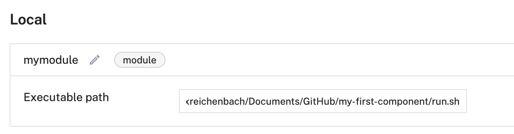
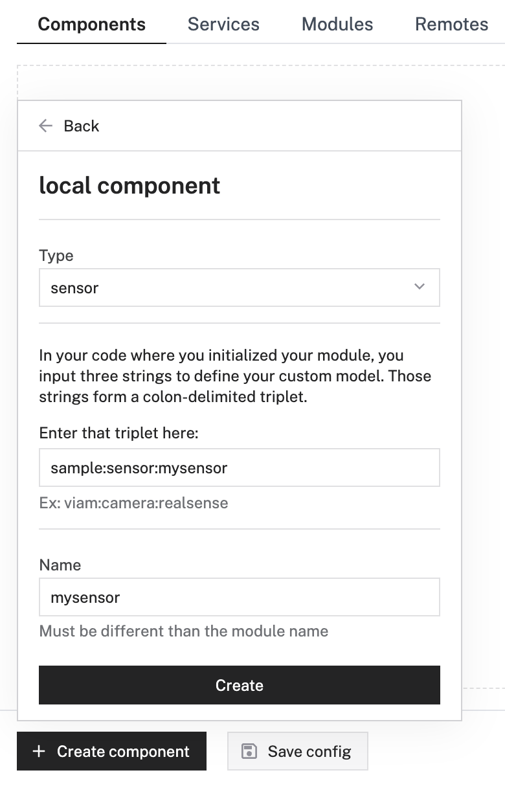
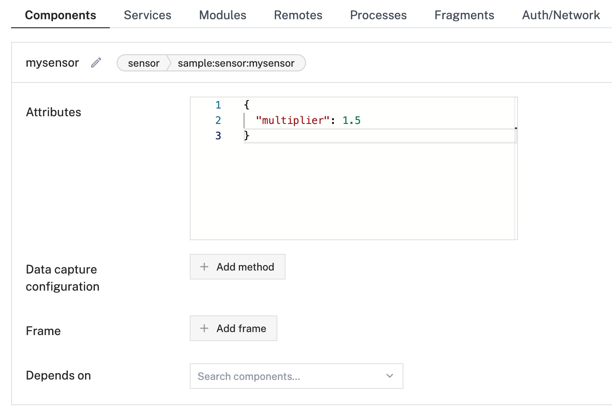
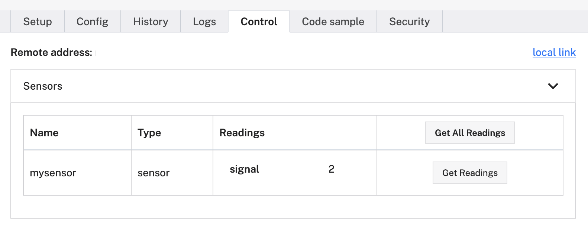

# Viam Starter Kit - My First Component
This repository contains a simple example of how to build a custom Viam sensor component. With this approach any type of hardware device can be wrapped and integrated into the Viam ecosystem. This first example uses Python and is closely inline with our documentation, providing you all the required details to further expand and explore components beyond a simple sensor.

[Learn how to build Viam components here](https://docs.viam.com/registry/create/)

## How to use this repo

1. Create an account on https://app.viam.com
2. Install the Viam RDK (e.g. directly on your mac) and register it with app.viam.com [Installation Docs](https://docs.viam.com/installation/)
3. Clone this repo
4. Add the repo folder as local module to your RDK configuration on app.viam.com

6. Add a local component

7. Configure your sensors attributes

8. Go and play :-)

