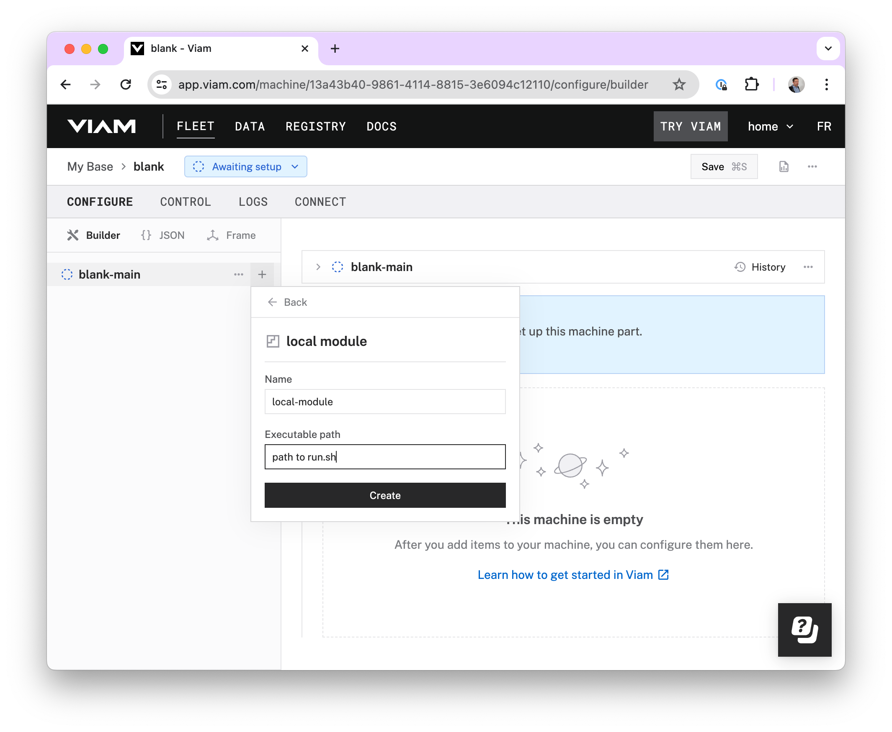
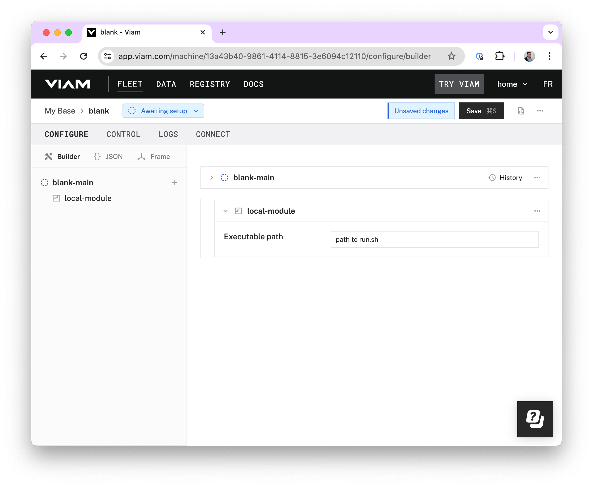
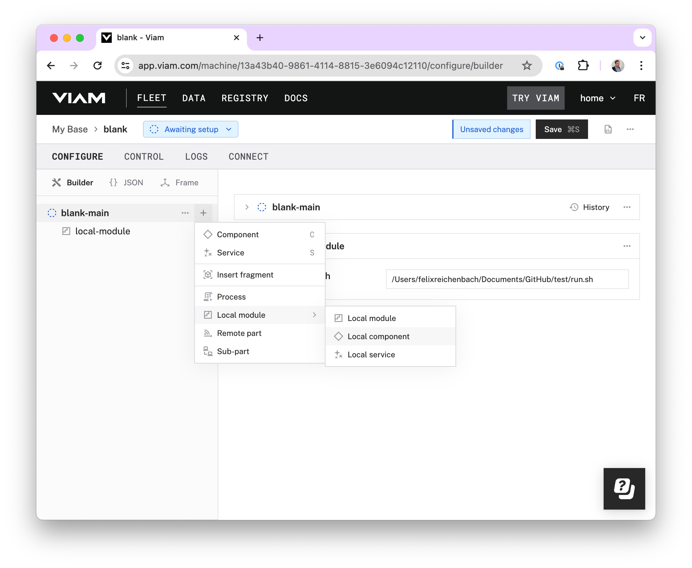
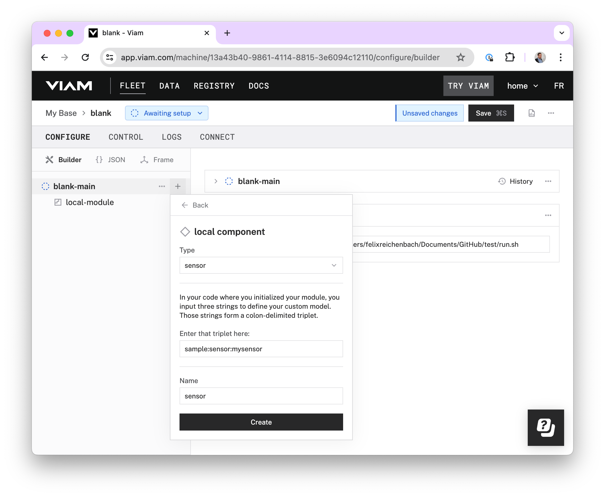
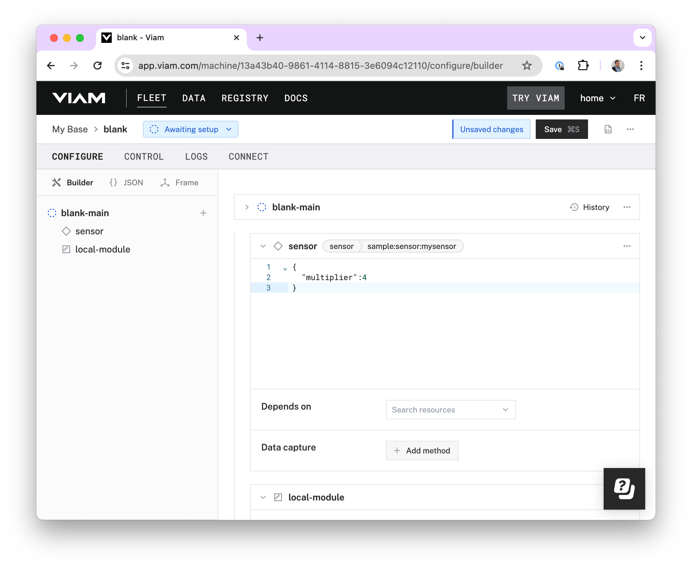
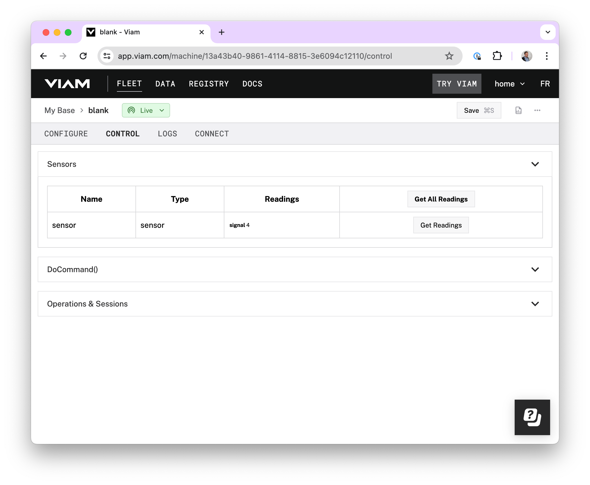

# Viam Starter Kit - My First Component
This repository contains a simple example of how to build a custom Viam sensor component. With this approach any type of hardware device can be wrapped and integrated into the Viam ecosystem. This first example uses Python and is closely inline with our documentation, providing you all the required details to further expand and explore components beyond a simple sensor.

[Learn how to build Viam components here](https://docs.viam.com/registry/create/)

For more advanced people or after having this successfuly completed, have a look at this more detailed [repository](https://github.com/viam-labs/python-example-module) which also explains how to use the Viam Modular Registry

## How to use this template repo

1. Create an account on https://app.viam.com
2. Install the Viam RDK (e.g. directly on your mac) and register it with app.viam.com [Installation Docs](https://docs.viam.com/installation/)
3. Create a new repo from this template repo and clone it to your machine

Follow these steps to add the sensor component to your machine:

Add a "local module" to your machine:

Add the path to your `run.sh` file:

Save the module:

Add a "local component" to your machine:

Fill in the details as shown on the screenshot:

Add the configuration attribute `multiplier`with a number of your choice and save the component:

Verify your machine is started and online, then navigate to the `control` tab and hit the "Get Readings" button:

